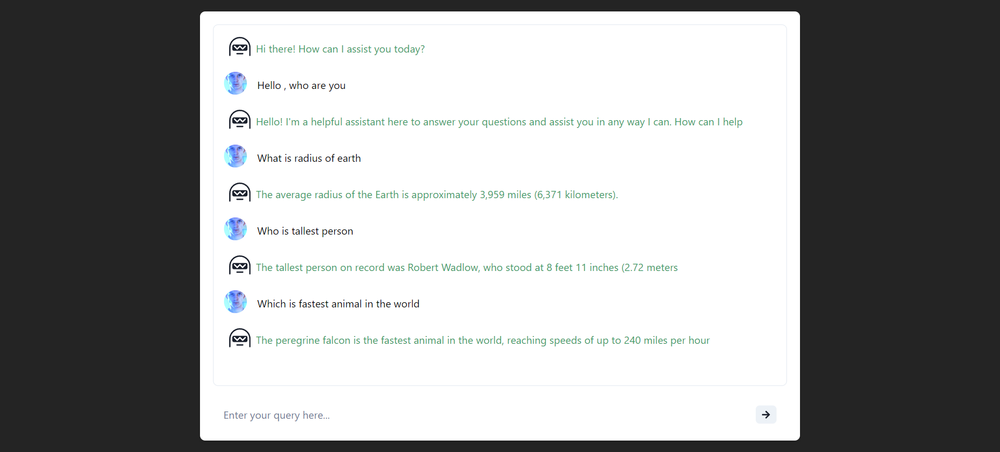

# Chatbot Chakra

This is a repository for  Chatbot Chakra




## Features:
- Reactjs, Nodejs, Express, Javascript
- Chakra UI design
- Rate limiting feature
- OPENAI's API integration


## Note : 
- Rate limit => only 3 req per minute is allowed (To protect misuse of API)
- API keys will expire in 1 - 2 days so please make sure to test it in this time only
- Please do not mis use API keys 
- You can provide your own API keys in `.env` file in server directory


## Setting up client

Open client directory and open terminal

#### Install packages

```shell
npm i
```

#### Start the app

```shell
npm run build
npm run dev
```


## Setting up server

Open server directory and open terminal

#### Install packages

```shell
npm i
```

#### Start the app

```shell
npm start
```


